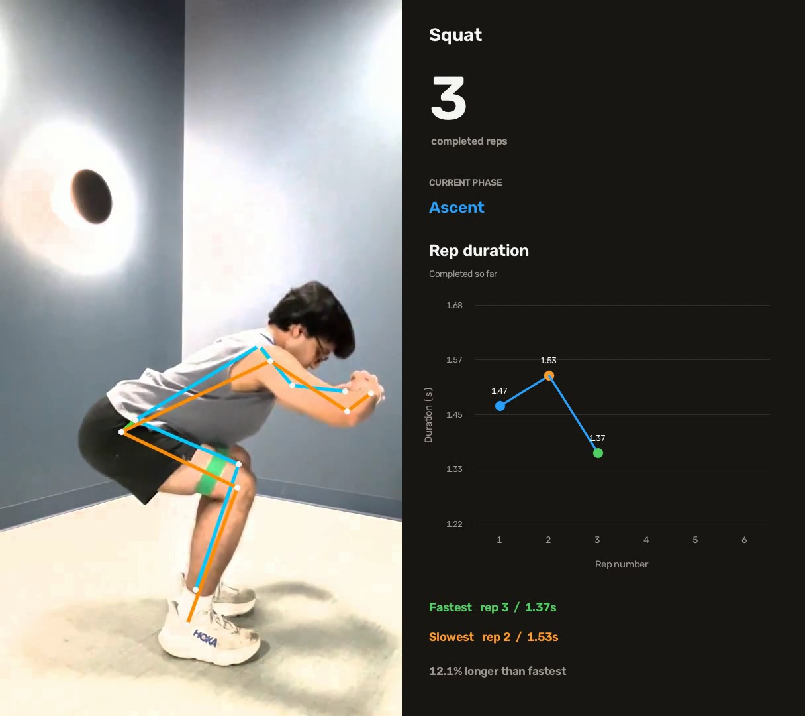

# Rehab Vision

Recorded-video movement analysis for four exercises in a home program. It reports observable timing, counts, and 2D consistency. It is not a clinical safety assessment, diagnosis, or exercise prescription.


## Example output




## Run it

1. **Get a VLM Run API key** at [app.vlm.run/sign-in](https://app.vlm.run/sign-in).

2. **Create a local `.env` file** at the repository root:

   ```bash
   cp .env.example .env
   ```

   Open `.env` and add the key after `VLMRUN_API_KEY=`. Do not commit this file. The pose pipeline uploads the converted video to VLM Run for processing.

3. **Create and activate the Conda environment:**

   ```bash
   conda env create -f environment.yml
   conda activate rehab-vision
   ```

4. **Add one exercise clip** under `data/input/`.

5. **Configure the recording** in [`config.py`](config.py) by setting `INPUT_VIDEO`, `EXERCISE`, `CAMERA_VIEW`, and `ANALYZED_LEG`.

6. **Run the analysis** from the repository root:

   ```bash
   python main.py
   ```

Results are saved under `data/output/`, including an annotated video, event data, a plot, and a session summary. Converted videos and pose results are cached to avoid unnecessary API requests.

## Validation

```bash
pytest -q
python scripts/make_demo.py
```
